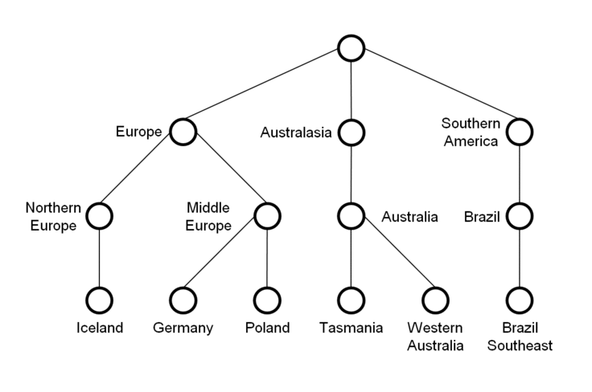

HierarchyGenerator
==================

About
-----

 The **Hierarchy Generator** is a simple tool written in Java which allows hierarchical data expressed in tables to be exported to hierarchical data formats, like RDF or SKOS. This makes it easier to import hierarchical data of various formats into, e.g. the [GFBio Terminology Server]. Taking the delimiter-separated data from the input file, the program constructs an ordered hierarchy and assigns a unique identifier to each node in a [breadth-first search]. The nodes are written to the output file in a user defined hierarchical format including, e.g. the parent and child nodes and – if present – a definition or description of the term.
 

Download
--------

The Hierarchy Generator can be downloaded at its [GitHub repository].

Features
--------

### Assignment of property values

Each term in the hierarchy can have property values assigned to them by defining property columns which include, e.g. a definition or description of the term.

**Example:** The notation

`Australasia,,,5,`

assigns the entry “5” to the property column 4 for the broader term “Australasia”. Thus, not only the leaves (e.g. “Western Australia”, “Tasmania”) of the hierarchical tree can have property values assigned to them, but also the higher/broader nodes (e.g. “Australasia”, “Australia”).

### Assignment of unique identifiers

The Hierarchy Generator provides several possibilities for the assignment of unique identifiers to the hierarchy terms. The default identifier is based on the name of the term (e.g. “Germany”), if the names are not unique, an integer is added to the original name (e.g. “Germany\_1”). Other identifier types are numeric (integers starting with 1) and ordered numeric (level-based integers, e.g. “1.2.1”).

### Automatic fill down

If some of the hierarchically higher-ranking column entries of a line in the input file are missing (as can be the case for data originating from spreadsheets), the generator automatically supplements those with the column entries of the preceding line, equivalent to the “fill down” function of spreadsheet software.

**Example:** If the parameter *filldown* is set as true and the order of the hierarchy columns is 1,2,3, the lines

<code>Australasia,Australia,Tasmania,,TAS</code>

<code>,,Western Australia,,WAU</code>

are read as

<code>Australasia,Australia,Tasmania,,TAS</code>

<code>Australasia,Australia,Western Australia,,WAU</code>.

### Cross hierarchy linking

Cross hierarchy linking allows for elements to be linked to any of their ancestors instead of just to their parent. So in this example:
<code>Australasia,,Unchartered Territory,,AXX</code>
the unchartered territory would be on the same logical level as Tasmania or Western Austratia in the example above, but it would be a direct child of the element Australasia. 

How to call the program
-----------------------

In order to convert existing data to a hierarchical format, an **Input File** with delimiter-separated values and a **Settings File** defining the parameters of the Input File as well as the settings for the desired ouput format, are needed.

The Hierarchy Generator is called with the following command and generates an **Output File** called output.xml (default):

`java -jar HierarchyGenerator.jar MyCustomSettings.txt`

The path to the Input/Output File can be set in the Settings File.

Settings File
-------------

### Parameters

The Settings File consists of several parameters, some of which are mandatory whereas others are optional. Some parameters already have a default value. Lines in the Settings file starting with “\#” are ignored. All parameters are written in the following way: “ParameterName”+“Tabstop”+“ParameterValue”.

| Parameter name        | Ordinality               | Description                                                                                                                                                                                                                                                                                  | Default value |
|-----------------------|--------------------------|----------------------------------------------------------------------------------------------------------------------------------------------------------------------------------------------------------------------------------------------------------------------------------------------|---------------|
| inputFile             | mandatory                | The relative or absolute path to the input file in the file system.                                                                                                                                                                                                                          | ---           |
| outputFile            | optional                 | The relative or absolute path to the output file in the file system.                                                                                                                                                                                                                         | output.xml    |
| separatorCharacter    | optional                 | The delimiter character separating the values in one line (e.g. a comma for CSV-formatted text files).                                                                                                                                                                                       | ,             |
| quoteCharacter        | optional                 | If a value includes the separatorCharacter, the quoteCharacter can be used to indicate that the quoteCharacter does not have a delimiting function but is part of the value (e.g. “1,3-Bisphosphoglycerat” if a comma is the separatorCharacter)                                             | "             |
| filldown              | optional                 | The fill down option enabling the generator to automatically supplement empty column entries with the column entries of the preceding line.                                                                                                                                                  | true          |
| hierarchyColumns      | mandatory (at least one) | Comma separated numbers representing the hierarchical order of the hierarchy columns, no leading zeros, the count starts with 1. A column can be used in both HierarchyColumns and PropertyColumns.                                                                                          | ---           |
| propertyColumns       | optional                 | Comma separated numbers representing the property columns, no leading zeros, the count starts with 1. A column can be used in both HierarchyColumns and PropertyColumns.                                                                                                                     | ---           |
| idType                | optional                 | The type of the unique identifier for every node in the hierarchy. The available options are “numeric” (integers starting with 1), “ordered\_numeric” (level based integers, e.g. 1.2.1) and “nameBased” (the name of the term; if \<name> is already taken, it is \<name>\_2, \<name>\_3 etc.) | nameBased     |
| headerFile            | optional                 | The relative or absolute path to the header file in the file system. Th content of the header file will be printed at the start of the output file.                                                                                                                                          | ---           |
| footerFile            | optional                 | The relative or absolute path to the footer file in the file system. The content of the footer file will be printed at the end of the output file.                                                                                                                                           | ---           |
| firstRowAsColumnNames | optional                 | Boolean value (true\|1, false\|0). True if the first row includes the names of the columns.                                                                                                                                                                                                    | false         |
| showBroaderReference  | optional                 | Boolean value (true\|1,false\|0). True if the the broader relations (parent) of the term should be listed.                                                                                                                                                                                     | false         |
| showNarrowerReference | optional                 | Boolean value (true\|1,false\|0). True if the the narrower relations of the term (children) should be listed.                                                                                                                                                                                  | false         |

### Templates

The Settings File also defines the desired output format with the help of templates. There are four different templates and eight different placeholders which can be used for the format definition.

Each template can be referenced either by "column"+\<columnIndex>+\<TemplateName> (e.g. column2PropertyTemplate) in order to define a template for a specific column or by "default"+\<TemplateName> (e.g. defaultElementTemplate) in order to define a default template for all columns that do not have a specific template.

If a property template is using the columnIndex: if the columnIndex references a property column, then the property template is applied to all instances where this property is present. If however, the columnIndex references a hierarchy column, then this template is used for all properties of that particular hierarchy level (if the particular property doesn't have a property specific template as the property specific property templates are regarded as more important than the hierarchy specific property templates).

| Template name             | Definition                                                                                                                                         |
|---------------------------|----------------------------------------------------------------------------------------------------------------------------------------------------|
| ElementTemplate           | Template for the overall format of a single term. Can include the placeholders \<id>, \<name>, \<relations>, and \<properties>.                        |
| BroaderReferenceTemplate  | Template for the broader relations (parent). Is called by the placeholder \<relations>. Can include the placeholder \<parent>.                       |
| NarrowerReferenceTemplate | Template for the narrower relations (children). Is called by the placeholder \<relations>. Can include the placeholder \<child>.                     |
| PropertyTemplate          | Template for the content of the property columns. Is called by the placeholder \<properties>. Can include the placeholders \<property>, \<value>, \<property-X> and \<if-property-X>. |

| Placeholder  | Definition                                                                                                                                |
|--------------|-------------------------------------------------------------------------------------------------------------------------------------------|
| \<id>         | The unique identifier of the term (either numeric or name-based).                                                                         |
| \<name>       | The name of the term.                                                                                                                     |
| \<relations>  | The placeholder for the BroaderReferenceTemplate and the NarrowerReferenceTemplate.                                                       |
| \<parent>     | The ID of the parent term. Can be used in the BroaderReferenceTemplate.                                                                   |
| \<child>      | The ID(s) of the child term(s). Can be used in the NarrowerReferenceTemplate.                                                             |
| \<properties> | The placeholder for the PropertyTemplate.                                                                                                 |
| \<property>   | The name of the property column as defined in the first row (only if firstRowAsColumnNames == true). Can be used in the PropertyTemplate. |
| \<value>      | The value of the property column. Can be used in the PropertyTemplate.                                                                    |
| \<property-X> | The value of another property from a different column, whereby X is the columnIndex of the other property columns. If the property exists, it replaces the place holder, otherwise the placeholder is just removed. Can be used in the PropertyTemplate.                                                                    |
| \<if-property-X>| A conditional template, whereby X is the columnIndex of one of the property columns. If the property in this column exists and is not empty, then the content if the conditinal part of the fragment is shown.  This place holder requires a corresponding closing tag and is intended (but not required) to be used in conjunction with the <property-X> placeholder, e.g. <code>\<if-property-6> lang="\<property-6>"\</if-property-6></code>. Can be used in the PropertyTemplate.|
### Example Settings File

**MyCustomSettings.txt**

*(since markdown convertes all tabs to spaces, please note that, all indentations and and separations between the parameter name and value have to be done using tabs)*

    inputFile  ExampleData.csv
    separatorCharacter  ,
    hierarchyColumns    1,2,3
    propertyColumns 4,5
    outputFile  output.txt

    firstRowAsColumnNames   true
    showBroaderReference    true
    showNarrowerReference   true
    idType  ordered_numeric

    # default templates
    defaultElementTemplate  <id>{
            name = "<name>"
        <relations><properties>}

    ## default relation templates
    defaultBroaderReferenceTemplate     isChildOf <parent>
    defaultNarrowerReferenceTemplate        isParentOf <child>

    ## default property template
    defaultPropertyTemplate     <property>: <value>

    # column 2 template
    column2ElementTemplate  <id>_level2{
            level2_term = "<name>"
        <relations><properties>}

    ## column 2 relation templates
    column2BroaderReferenceTemplate     level2_term isChildOf <parent>
    column2NarrowerReferenceTemplate        level2_term isParentOf <child>

    ## column 2 property template
    column2PropertyTemplate     level2_<property>: <value>

Example Input File
------------------

The Input File must have lines of delimiter-separated hierarchical values.

**ExampleData.csv**

    GeographicRegionLevel1Term,GeographicRegionLevel2Term,GeographicRegionLevel3Term,Code,three-letter code
    Europe,Northern Europe,Iceland,,ICE
    ,Middle Europe,Germany,,GER
    Europe,,,1,
    ,Northern Europe,,10,
    ,Middle Europe,,11,
    Australasia,Australia,Tasmania,,TAS
    ,,Western Australia,,WAU
    Australasia,,,5,
    ,Australia,,50,
    Europe,Middle Europe,Poland,,POL
    Southern America,Brazil,Brazil Southeast,,BZL
    Southern America,,,8,
    ,Brazil,,84,

Example Output File
-------------------

Given the Settings File *MyCustomSettings.txt* and the Input File *ExampleData.csv*, the Hierarchy Generator generates the following Output File:

**ouput.txt**

    1{
        name = "Europe"
        isParentOf 1.2
        isParentOf 1.1
        Code: 1
    }
    2{
        name = "Australasia"
        isParentOf 2.1
        Code: 5
    }
    3{
        name = "Southern America"
        isParentOf 3.1
        Code: 8
    }
    1.1_level2{
        level2_term = "Northern Europe"
        level2_term isChildOf 1
        level2_term isParentOf 1.1.1
        level2_Code: 10
    }
    1.2_level2{
        level2_term = "Middle Europe"
        level2_term isChildOf 1
        level2_term isParentOf 1.2.1
        level2_term isParentOf 1.2.2
        level2_Code: 11
    }
    2.1_level2{
        level2_term = "Australia"
        level2_term isChildOf 2
        level2_term isParentOf 2.1.1
        level2_term isParentOf 2.1.2
        level2_Code: 50
    }
    3.1_level2{
        level2_term = "Brazil"
        level2_term isChildOf 3
        level2_term isParentOf 3.1.1
        level2_Code: 84
    }
    1.1.1{
        name = "Iceland"
        isChildOf 1.1
        three-letter code: ICE
    }
    1.2.1{
        name = "Germany"
        isChildOf 1.2
        three-letter code: GER
    }
    1.2.2{
        name = "Poland"
        isChildOf 1.2
        three-letter code: POL
    }
    2.1.1{
        name = "Tasmania"
        isChildOf 2.1
        three-letter code: TAS
    }
    2.1.2{
        name = "Western Australia"
        isChildOf 2.1
        three-letter code: WAU
    }
    3.1.1{
        name = "Brazil Southeast"
        isChildOf 3.1
        three-letter code: BZL
    }

  [GFBio Terminology Server]: http://terminologies.gfbio.org/
  [breadth-first search]: http://en.wikipedia.org/wiki/Breadth-first_search
  [GitHub repository]: http://github.com/gfbio/HierarchyGenerator
